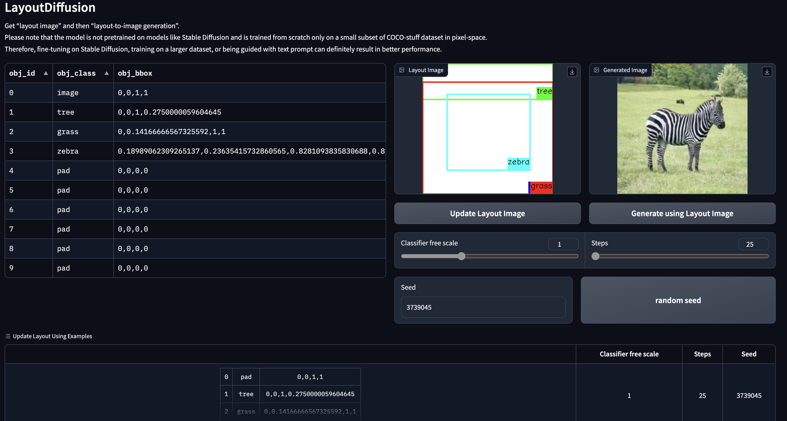
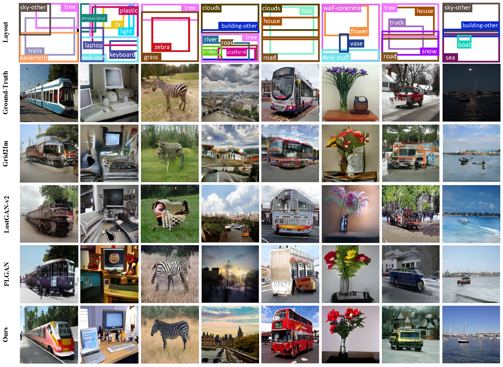

## 介绍
本项目是CVPR2023论文：[LayoutDiffusion: Controllable Diffusion Model for Layout-to-image Generation](https://arxiv.org/abs/2303.17189)的mindspore实现。
论文原始的pytorch实现请参考论文作者[郑光聪(浙江大学)](https://github.com/ZGCTroy)个人主页中的[Layout Diffuion](https://github.com/ZGCTroy/LayoutDiffusion)仓库。


LayoutDiffusion是一种基于扩散模型的布局到图像的生成方法，它可以在保证生成质量的同时，对全局布局和每个细节对象进行强控制。
为了克服图像和布局之间的多模态融合难题，本文提出了一种结构化图像块的构造方法，将区域信息和图像块转换成特殊的布局，与普通布局以统一的形式进行融合。
本文还提出了布局融合模块（LFM）和对象感知交叉注意力（OaCA），用于建模多个对象之间的关系，使其具有对象感知和位置敏感的特性，从而能够精确地控制空间相关信息。
论文在COCO-stuff和VG数据集上进行了大量的实验，证明了其在FID和CAS指标上优于之前的最先进方法。


同时，本项目为了按照原论文的采样方案进行加速采样，实现了一个mindspore版本的[dpm-solver](https://github.com/LuChengTHU/dpm-solver)，采样时将采样方法设置为dpm-solver，并将采样步数设置为25步，就可以进行更快的采样。

[](https://paperswithcode.com/sota/layout-to-image-generation-on-coco-stuff-4?p=layoutdiffusion-controllable-diffusion-model)

[](https://paperswithcode.com/sota/layout-to-image-generation-on-visual-genome-4?p=layoutdiffusion-controllable-diffusion-model)

* [papers with code](https://paperswithcode.com/paper/layoutdiffusion-controllable-diffusion-model)
* [arxiv](https://arxiv.org/abs/2303.17189)
* [cvpr open access paper pdf](https://openaccess.thecvf.com/content/CVPR2023/papers/Zheng_LayoutDiffusion_Controllable_Diffusion_Model_for_Layout-to-Image_Generation_CVPR_2023_paper.pdf)
* [cvpr open access supplement pdf](https://openaccess.thecvf.com/content/CVPR2023/supplemental/Zheng_LayoutDiffusion_Controllable_Diffusion_CVPR_2023_supplemental.pdf)

## Gradio Webui演示


## 任务流水线


## 在COCO-stuff数据集上的效果



## 环境配置
```bash
conda create -n LayoutDiffusion python=3.8
conda activate LayoutDiffusion

conda install mindspore==2.0.0 cudatoolkit=11.2 -c mindspore -c conda-forge
pip install omegaconf opencv-python h5py==3.2.1 gradio==3.24.1

python setup.py build develop
```

## 启动Gradio Webui(不需要配置数据集)
```bash
  mpirun python scripts/launch_gradio_app.py \
  --config_file configs/COCO-stuff_256x256/LayoutDiffusion_large.yaml \
  sample.pretrained_model_path=./pretrained_models/COCO-stuff_256x256_LayoutDiffusion_large_ema_1150000.pt \
  -n 1
```
在“--config_file XXX”后添加“--share”以允许远程链接共享

## 数据集配置
参考 [这里](./DATASET_SETUP.md)

## 预训练模型
| 数据集                                         |    分辨率    |        step, FID (采样图片数量 x 次数)         | 链接                |
|---------------------------------------------|:---------:|:--------------------------------------:|-------------------|
| COCO-Stuff 2017 segmentation challenge<br/> | 256 x 256 | step=25 <br/>  FID=16.50  ( 3097 x 5 ) | [Google drive](#) | 
| COCO-Stuff 2017 segmentation challenge<br/> | 128 x 128 | step=25 <br/>  FID=16.47  ( 3097 x 5 ) | [Google drive](#) | 
| VG                                          | 256 x 256 | step=25 <br/>  FID=15.91  ( 5097 x 1 ) | [Google drive](#) | 
| VG                                          | 128 x 128 | step=25 <br/>  FID=16.22  ( 5097 x 1 ) | [Google drive](#) | 

## 训练
* bash/train.bash
```bash
  CUDA_VISIBLE_DEVICES=0,1,2,3,4,5,6,7 \
  mpirun python scripts/launch_gradio_app.py \
  --config_file configs/COCO-stuff_256x256/LayoutDiffusion_large.yaml \
  -n 8
```

## 采样
* bash/sample.bash

## 评分标准
**你需要为每一个评价指标配置一个（pytorch）环境。**

### FID
Fr‘echet Inception Distance (FID)指标使用这个仓库评测 [pytorch-fid](https://github.com/mseitzer/pytorch-fid). 

完成采样后，使用以下命令测试FID指标:

```bash
CUDA_VISIBLE_DEVICES=0 python fid_score.py path/to/generated_imgs path/to/gt_imgs --gpu 0
```

### IS
使用 [Improved-GAN](https://github.com/openai/improved-gan) 评估Inception Score(IS)。

采样后，使用以下命令测量IS：
```bash
cd inception_score
CUDA_VISIBLE_DEVICES=0 python model.py --path path/to/generated_imgs
```

### DS
使用[PerceptualSimilarity](https://github.com/richzhang/PerceptualSimilarity)评估Diversity Score(DS)。

原论文代码修改了`lpips_2dirs.py`，以便更容易自动计算DS的均值和方差，请参考[这里](https://github.com/ZGCTroy/LayoutDiffusion/blob/master/scripts/lpips_2dirs.py)。
```bash
CUDA_VISIBLE_DEVICES=0 python lpips_2dirs.py -d0 path/to/generated_imgs_0 -d1 path/to/generated_imgs_1 -o imgs/example_dists.txt --use_gpu
```

### YOLO Score
使用[LAMA](https://github.com/ZejianLi/LAMA)评估YOLO分数。

原论文代码修改了 [`test.py`](https://github.com/ZGCTroy/LayoutDiffusion/blob/master/scripts/lama_yoloscore_test.py) 来测量完整注释（在 coco 数据集中使用 `instances_val2017.json`）和 [过滤注释](https://drive.google. com/file/d/1T5A2AwNF2gZmi2LDArkE7ycBwGDuhq4w/view?usp=共享）。

采样后，使用以下命令测量YOLO Score：
```bash
cd yolo_experiments
cd data
CUDA_VISIBLE_DEVICES=0 python test.py --image_path path/to/generated_imgs
```

### CAS
使用[pytorch_image_classification](https://github.com/hysts/pytorch_image_classification)评估分类分数(CAS)。

裁剪图像的 GT 框区域，并根据类别以 32×32 的分辨率调整对象的大小。 然后在生成的图像上使用裁剪后的图像训练 ResNet101 分类器，并在真实图像上的裁剪后的图像上进行测试。 最后，使用生成的图像测量 CAS。

```bash
CUDA_VISIBLE_DEVICES=0 python evaluate.py --config configs/test.yaml
```

您可以在configs/test.yaml 中配置ckpt路径和数据集信息。

## 引用
```
@misc{zheng2023layoutdiffusion,
    title={LayoutDiffusion: Controllable Diffusion Model for Layout-to-image Generation}, 
    author={Guangcong Zheng and Xianpan Zhou and Xuewei Li and Zhongang Qi and Ying Shan and Xi Li},
    year={2023},
    eprint={2303.17189},
    archivePrefix={arXiv},
    primaryClass={cs.CV}
}
```
